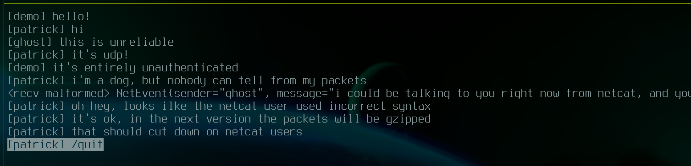

# tinybcast

This is a small haskell program implementing a udp broadcast chat client.

### usage

* You can run with..
    * `bcast username` to broadcast on a LAN, or..
    * `bcast username listenHost listenPort [destHost destPort ...]` to specify
      alternate destination addresses.
* Type words, use the left, right, home, end keys to move the cursor.
* Press enter to send.
* Press escape to quit. (`/quit` isn't a command, just for show)

## architecture

<caption>There are five pieces of state (boxes), and five threads (colored arrows).</caption>

### state (boxes)

1. A `vty` is used to get events from the user and display the UI.
1. A `TVar` `appState` is the content which is displayed in the UI.
1. A `TChan` `netOutbox` is the outgoing event buffer.
1. A `TChan` `netInbox` is the incoming event buffer.
1. A socket is used to send and receive on the network.

### threads (colored arrows)

1. **frontendInput**: Block until a `vty` event, apply the event to `appState`,
   optionally emit to `netOutbox`.
    * Not all `vty` events require a network event. When typing into the
      buffer, events are handled by applying to `appState` directly so the UI
      can update. When you press the "Enter" key, the buffer is cleared and a
      network event is emitted.
1. **fontendDisplay**: Render `appState` to `vty` and then block until `appState`
   changes.
1. **backendSend**: Block until a `netOutbox` event, broadcast it to the network
   (and also copy it over to `netInbox`).
    * We copy events directly from the outbox to the inbox because the user
      shouldn't have to wait for the network to get feedback from the UI. If
      you're implementing a message-delivery protocol, then you might be
      required to order outgoing messages, and so this behavior might be
      incorrect.
1. **backendReceive**: Block until the network receives a packet, deserialize it
   and emit to `netInbox`.
1. **protocolReordering**: Block until a `netInbox` event and apply it to
   `appState`.
    * This is kind of a silly thread that doesn't do very much but shuffle
      things between references. It's somewhat of a placeholder for if you were
      implementing a message-delivery protocol. Much of the time you'd need to
      reorder and delay received messages before delivering them to the
      application. This thread might be where that code would go?

### dependencies

* `vty` provides the UI.
* `network` provides the sockets.
* `async` provides threads.
* `stm` provides mutable references which can be accessed atomically.
